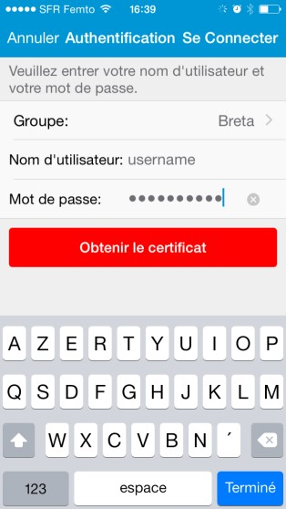
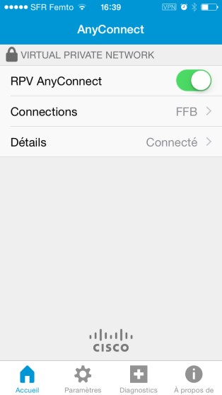

# Installation du VPN Cisco AnyConnect sur Mobile \(iOS\)

Installation du VPN Cisco AnyConnect sur iOS

Ce document a pour but de vous accompagner lors de l’installation du VPN Cisco AnyConnect sur votre appareil iOS.

1. Ouvrir l’Apple Store, chercher « Cisco AnyConnect » puis la télécharger sur votre appareil

1. Lancer l’application.

1. Accepter le message d’avertissement. Puis aller dans « Connections ».

1. Aller dans « Ajouter une connexion RPV… » puis renseigner les informations suivantes :
   1. Description : **FFB**
   2. Adresse : **vpns.itffb.fr**
   3. Aller dans « Avancé »
2. Passer le champs « Certificat » en « Désactivé ». Puis revenir en arrière et enregistrer.

1. Choisissez « Allow » sur la boite de dialogue qui apparait. Puis valider avec votre empreinte digitale ou votre code de déverrouillage.
2. Aller dans « Paramètres » puis décocher « Bloquer les serveurs non fiables ».
3. Retourner sur « Accueil » et activer « RPV AnyConnect ». Toucher

« Continuer » lors de l’affichage de message d’avertissement.

1. Sélectionner le groupe _Breta_ et renseigner vos identifiants sous la forme NomP \(nom + première lettre du prénom\) ainsi que votre mot de passe, puis toucher « Se Connecter ». La connexion est établie.

