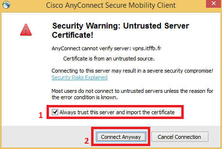

# Installation du VPN Cisco AnyConnect sur PC

Installation du VPN Cisco AnyConnect sur PC

Ce document a pour but de vous accompagner lors de l’installation du VPN Cisco AnyConnect sur votre ordinateur.

Installation

1. Ouvrir Internet Explorer sur la page [_https://vpns.itffb.fr_](https://vpns.itffb.fr/)
2. Sélectionner le groupe _Breta_ et renseigner vos identifiants sous la forme NomP \(nom + première lettre du prénom\) ainsi que votre mot de passe.
3. Installer le module complémentaire Cisco si demandé.
4. Patienter pendant l’installation du VPN.

1. L’installation du VPN est terminée.

Première connexion

1. Pour configurer la connexion au VPN, ouvrir l’application VPN Cisco AnyConnect, puis cliquer sur l’engrenage en bas à gauche.
2. Dans la fenêtre de réglages, décocher « Block connections to untrusted servers ».

1. Cocher la case « Disable Captive Portal Detection »
2. Inscrire l’adresse « vpns.itffb.fr » dans le cadre puis cliquer sur « Connect ».
3. Cocher la case « Always trust this server and import the certificate » puis cliquer sur « Connect Anyway ».
4. Sélectionner le groupe _Breta_ et renseigner vos identifiants sous la forme NomP \(nom + première lettre du prénom\) ainsi que votre mot de passe, puis valider.
5. La connexion est établie.

