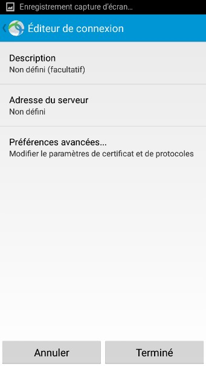

# Installation du VPN Cisco AnyConnect sur Mobile \(Android\)

Installation du VPN Cisco AnyConnect sur Android

Ce document a pour but de vous accompagner lors de l’installation du VPN Cisco AnyConnect sur votre appareil Android.

1. Ouvrir le Play Store, chercher « Cisco AnyConnect » puis l’installer sur votre appareil.

1. Lancer l’application.

1. Aller dans « Connections ». Puis dans

### « Ajouter une nouvelle connexion

VPN… »

1. Renseigner les informations suivantes : Description : **FFB**

Adresse : **vpns.itffb.fr**

Puis toucher « Terminé ».

1. Aller dans « Settings », décocher « Bloquer les serveurs non fiables », puis toucher « Paramètres ».

1. Activer « VPN AnyConnect ». Toucher « Continuer » lors de l’affichage de message d’avertissement.

1. Sélectionner le groupe _Breta_ et renseigner vos identifiants sous la forme NomP \(nom + première lettre du prénom\) ainsi que votre mot de passe, puis toucher « Se Connecter ».

Valider l’avertissement.

La connexion est établie.

